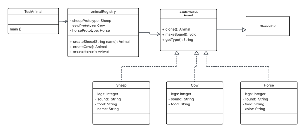

# Prototype Design Pattern 

This activity demonstrates the **Prototype Design Pattern** in Java.
Instead of creating new objects from scratch, objects are created by **cloning existing prototype instances**.

This approach improves performance and flexibility, especially when object creation is expensive.

---

## Design Pattern Used
**Prototype Pattern**
* Creates objects by copying an existing object (prototype)
* Uses a `clone()` method
* Reduces the need for repeated instantiation

---

## Project Structure

```
src/
 ├── Animal.java
 ├── Sheep.java
 ├── Cow.java
 ├── Horse.java
 ├── AnimalRegistry.java
 └── TestAnimal.java
```

---

## Classes Description

### Animal (Interface)
* Declares `clone()`, `makeSound()`, and `getType()`

### Sheep, Cow, Horse (Concrete Classes)
* Implement `Animal`
* Provide their own cloning logic
* Define unique properties (e.g., name, color)

### AnimalRegistry
* Stores prototype objects
* Creates new objects by cloning prototypes

### TestAnimal
* Main class
* Demonstrates how objects are created using the registry

---

## Sample Output

```
Dolly says: Baa
Molly says: Baa
Cow says: Moo
Horse says: Neigh
Sheep
Cow
Horse
```

---

## Key Concepts

* **Cloning instead of instantiation**
* **Decouples object creation from implementation**
* **Efficient for repeated object creation**

--- 

Below is the **UML Class Diagram** for this project:


